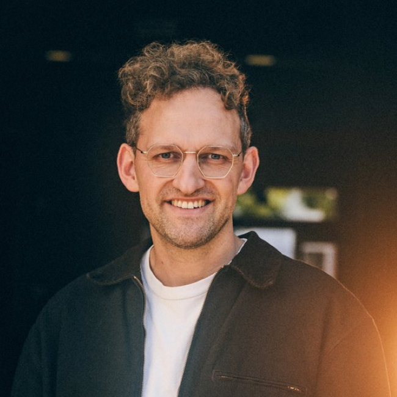
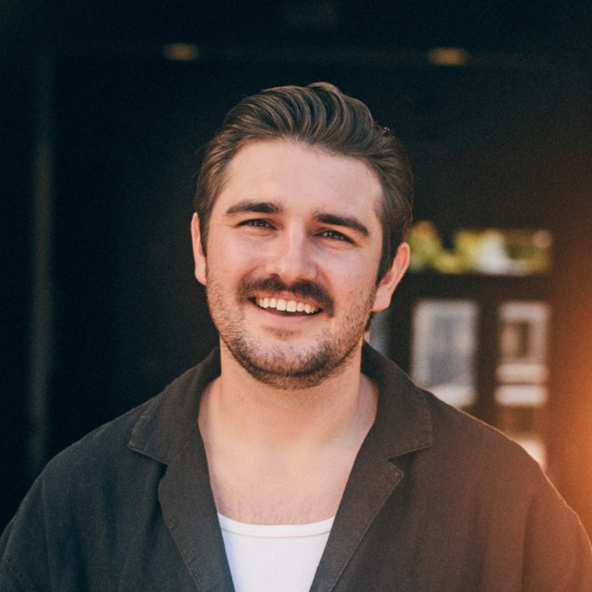
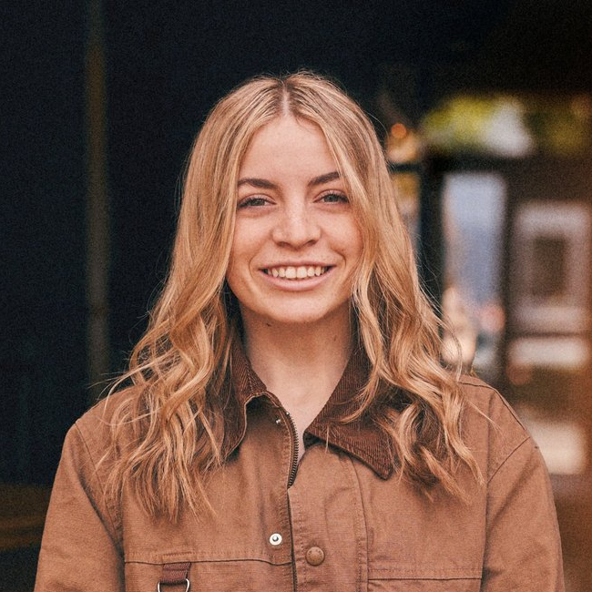

# Welcome

Here's an intro paragraph.

## Vision and values

TODO.

## Our team

### Luke & Anna Hellebronth

We've been leading worship and worship teams for 15 years at 3 different churches before coming to serve at Rockharbor. We've also been part of a ministry called Worship Central, which trained and equipped worship leaders and teams around the world. We've also written songs and have recorded music with the worship teams and ministries ministries we've been involved with, as well as personal projects.

Here at Rockharbor, we are responsible for the direction, stewardship and health of this worship team.

<!--

    

    

    

    

-->

### Chipper Lloyd

Hi! I'm Chipper and I...

### Sammy Gayer

Hi! I'm Sammy and I...

## Joining the team

If you'd like to join...

<!-- link to roles, skills, commitments? -->
